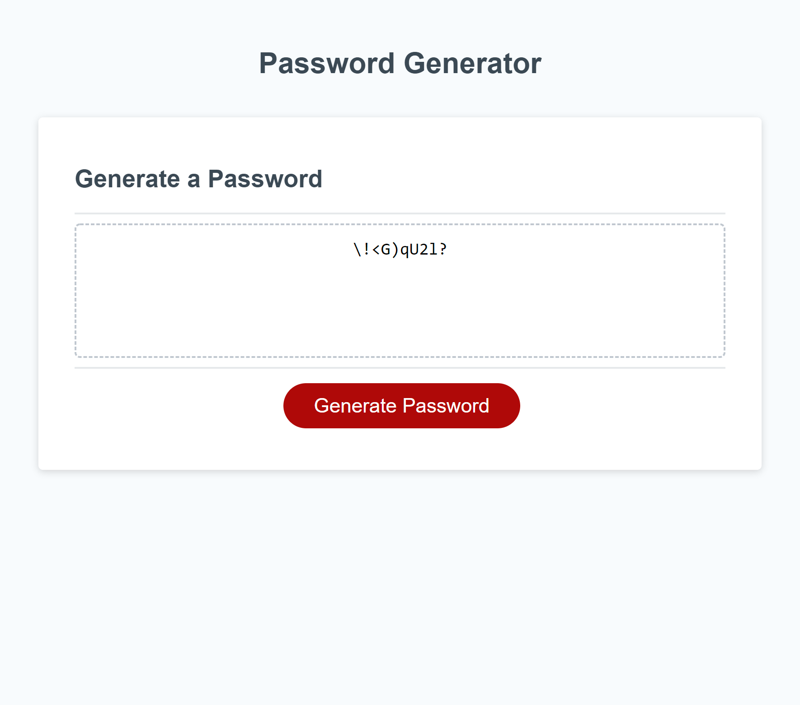

## Password Randomizer-Project 3
## Description

```
GIVEN I need a new, secure password
WHEN I click the button to generate a password
THEN I am presented with a series of prompts for password criteria
WHEN prompted for password criteria
THEN I select which criteria to include in the password
WHEN prompted for the length of the password
THEN I choose a length of at least 8 characters and no more than 128 characters
WHEN prompted for character types to include in the password
THEN I choose lowercase, uppercase, numeric, and/or special characters
WHEN I answer each prompt
THEN my input should be validated and at least one character type should be selected
WHEN all prompts are answered
THEN a password is generated that matches the selected criteria
WHEN the password is generated
THEN the password is either displayed in an alert or written to the page
```

## Visuals



## Usage

```
Creates a randomized password between 8 and 128 characters long.
Users have selection options of Uppercase characters, Lowercase characters, Special Characters and numbers.
Program takes selections and randomizes a password containing all user selection.
```

## Authors and acknowledgment

Joshua Bohde-Instructor;
W3 Schools;
MDN Web Docs;
[Tony Teaches Tech Refresher on prompts and confirms and looping with them](https://www.youtube.com/watch?v=bNtyTGBtbK4)

## Project status

Complete.

## Links
[Repo Link](https://github.com/ptodd15/password-randomizer);
[Website Link](https://ptodd15.github.io/password-randomizer/)
